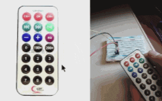
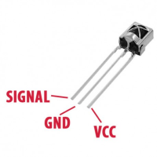

# IR Remote

A simple example that reads signals from a IR remote through serial communication and displays it in a `pygame` application. Used the HX1838 IR receiver and remote set.

## Hookup

Depends on the IR receiver you're using, but for the HX1838 it is as shown in the previous image. In this sketch, the signal is connected to **digital pin 7.**

Image from [Hacktronics.](https://hacktronics.co.in/through-hole-led/vs1838b-hx1838-infrared-receiver-with-shield)
